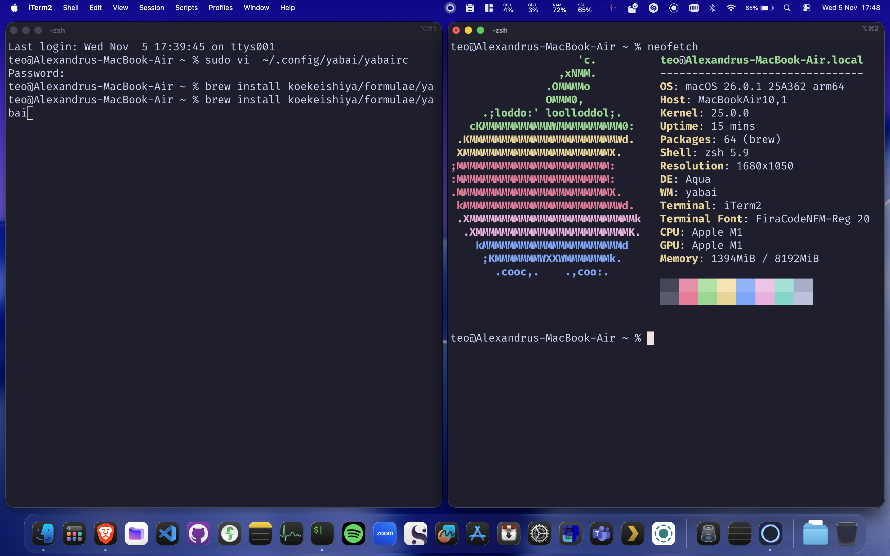

# yabai-config



[step-by-step](https://medium.com/unixification/yabai-the-macos-tiling-window-manager-c5bda9d60bfc)

## From the article:
Disabling SIP
Since I have an M1, I will be going over the configuration with an M1. For configuration on Intel Macs see this.

- Power off your device
- Hold the power button until you see the screen say Loading startup options. Then click Options and Continue
- In the menu bar go to Utilities, then Terminal
- Type the following into the terminal:
```csrutil disable --with kext --with dtrace --with basesystem```
Warnings can be safely ignored. Afterward, reboot.

- Type the following to enable non-Apple-signed arm64e binaries and reboot:

```sudo nvram boot-args=-arm64e_preview_abi```
This command is important because if you don’t do this, scripting additions won’t work. Reboot when the command finishes.

To check if SIP is turned off run ```csrutil status```

Notes:

- install via brew with ```brew install koekeishiya/formulae/yabai --HEAD```
```codesign -fs 'yabai-cert' $(brew --prefix yabai)/bin/yabai```
- create config in ```~/.config/yabai/yabairc```
- start with ```yabai --start-service``` , use restart-service or stop-service accordingly

# skhdrc

Yabai itself does not handle hotkeys.
You use a separate daemon called skhd (Simple HotKey Daemon) to define keybindings that trigger yabai commands.

```brew install skhd```
```skhd --start-service```

add the config in this repo to ```~/.config/skhd/skhdrc```

start, restart and stop services are the same as for yabai

